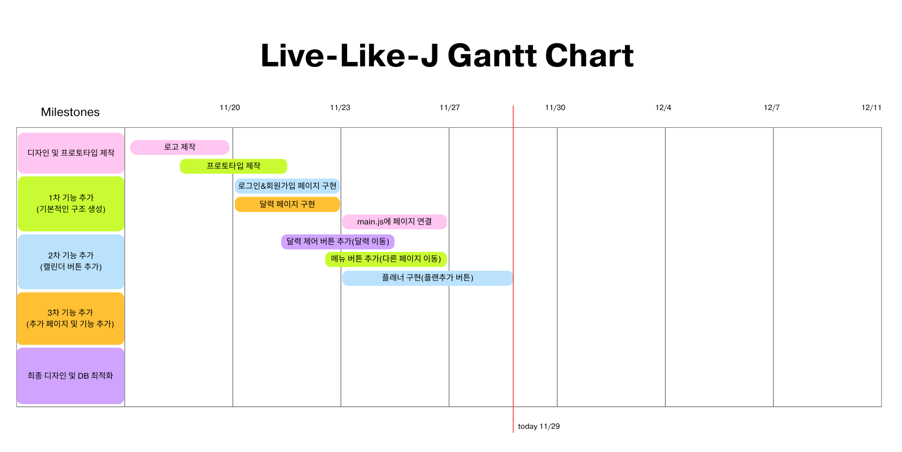
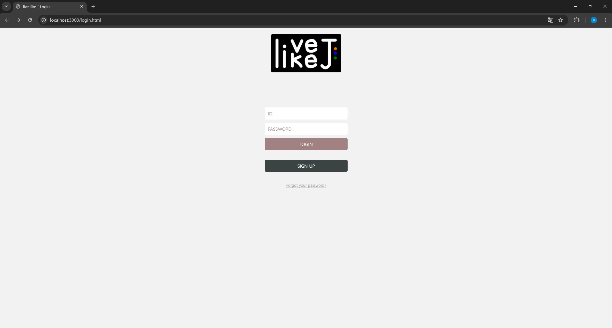
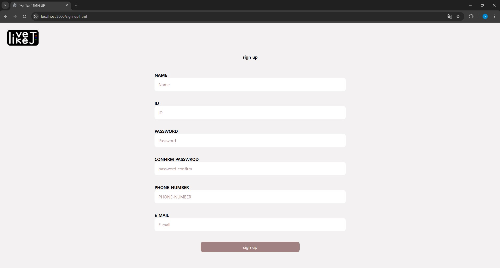
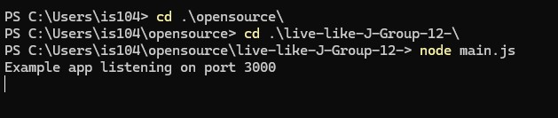
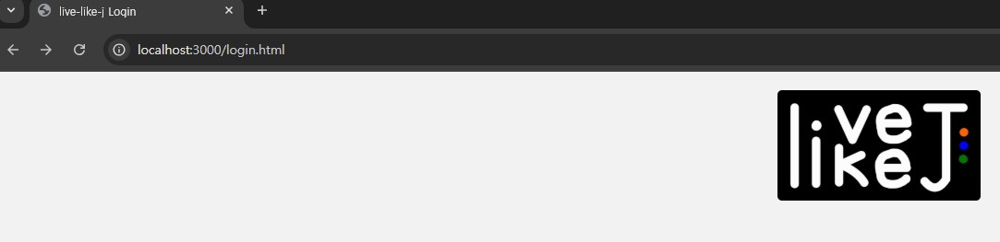
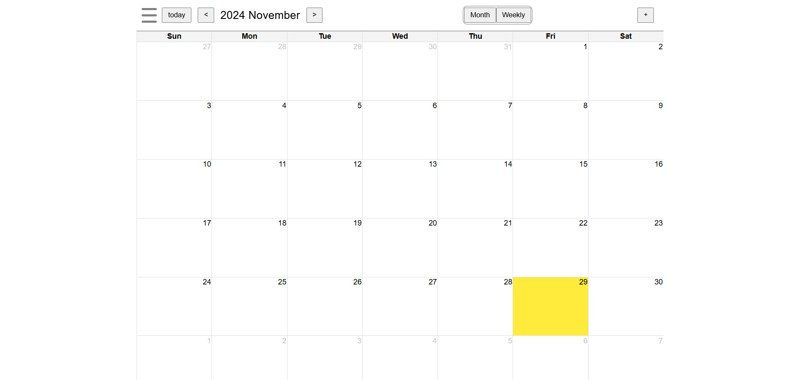
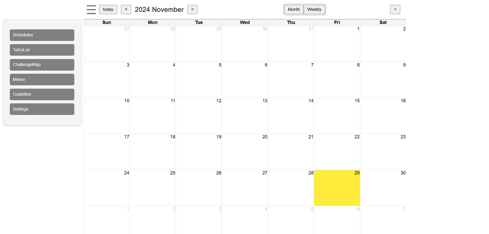

# Progress Report for Team #12

## Project Summary

1. 캘린더 구현 : <br/>
    ● 날짜가 격자로 정리된 시각적으로 구조화된 캘린더 화면 개발<br/>
	● 연도 및 월 이동 버튼을 이용해 특정 날짜로 접근할 수 있는 기능 구현<br/>

2. 메인 페이지 프로토타입 디자인(도안) : <br/>
	● 초기 로그인 화면 설계 및 실패 시 팝업창을 통한 사용자 알림 기능 구현<br/>
	● 회원가입 화면 설계 및 성공/실패 시 각각의 상황 처리<br/>
	● 본인 인증을 통한 ID 및 비밀번호 찾기 화면 설계<br/>

3. 로그인 완료 후 페이지 프로토타입 디자인(도안) : <br/>
	● 좌측에 Dropdown 메뉴와 그 하위 항목들을 활용해 화면 구성<br/>
	● 일정 및 작업 관리 도구 제공<br/>
        ㄴ 일정 기록 : 카테고리 선택, 시간 설정, 메모 입력 기능 포함<br/>
		ㄴ 기록된 일정 수정 및 삭제 프로세스와 이를 확인할 수 있는 화면 설계<br/>
	● 할일 기록 및 관리 : 우선순위 설정, 메모 입력 등 작업 효율화를 위한 기능 포함<br/>
4. CSS 및 인터페이스 디자인 : <br/>
	● 로그인 및 회원가입 창의 간단한 형태와 기능을 수행할 CSS 구현<br/>

### Project Schedule
<br/>


### Project Screenshot


[Page 1_(1)_Main Page]
<br/>
<br/>

[Page 1_(2)_SignUp Page]
<br/>
<br/>

[로컬호스트로 웹 페이지 연결]
<br/>
<br/>

<br/>

[Page 2_(1)_Hub Page]
<br/>
<br/>

[Page 2_(2)_Menu Button]
<br/>
<br/>

[Page 3_Yearly Calendar]
<br/>
<br/>

[Page 4_My Page]
<br/>
<br/>


## Individual Progress Status
<br/>


김지성
- 로고 제작([commit Link](https://github.com/z2sseong2/live-like-J-Group-12-/commit/bbf789cde585b05822526c3cd4688529197091fb))
- 프로토타입 및 플로우차트 작성([commit Link](https://github.com/z2sseong2/live-like-J-Group-12-/commit/c4f1bb293d40f5d3eb7f6297fa010e45c432a706))([commit Link](https://github.com/z2sseong2/live-like-J-Group-12-/commit/f27c37cf2323b17307170d5d0ea27c34cc6bb2e1))([commit Link](https://github.com/z2sseong2/live-like-J-Group-12-/commit/4dea823e47a2d6d8210fd191731e8a7777f5f358))
- 링크 수정 : Page 1 -> Page 2 전환 위해 Page 1의 window.location.href 수정 / Page 1의 img 링크 수정
- 메뉴리스트에 Profile 버튼 추가 후 Page 4(My Page) 구현하여 링크 삽입
- Page 3(Yearly Calendar), Page 4(My Page) 구현 진행중
- 상단 네비게이션 우측에 로고이미지버튼 추가하고 Page 2로 링크 연결하여 어느 페이지에서든 Hub Page로 이동할 수 있도록 하였으며 이와 작성한 프로토타입을 기반으로 앞으로 프로젝트 진행을 위해 필요한 페이지별 디렉토리(Page5~16) 생성
([commit Link](https://github.com/z2sseong2/live-like-J-Group-12-/commit/305ebea1e05507d64705b6f3d2ca29306038bcbf))

김지훈
- 스케쥴을 입력 할 수 있는 페이지 구현 ([commit Link](https://github.com/z2sseong2/live-like-J-Group-12-/commit/e82247e154dd4b13e62fb03f3f2eea3db213a5c0))
- 주간 플랜가져오는 파일 구현, 달력에서 x키눌러서 plan삭제 구현([commit Link](https://github.com/z2sseong2/live-like-J-Group-12-/commit/864d662bf062ec213249000fd8fff3a09bdc9c2c))
- 주간 플랜 파일을 삭제하고 그 파일을 캘린더 파일안에 구현(추가 작업에 용이하도록) ([commit Link](https://github.com/z2sseong2/live-like-J-Group-12-/commit/073add47e441b6c64395452ce7170897b7dde524#diff-5f38abb3fad5051291c4f847bda8f2979929e89e4d74fbdafd5de2aebc9c0db2))

전문성
- 캘린더 메인페이지 좌측 상단 메뉴버튼 생성([commit Link](https://github.com/z2sseong2/live-like-J-Group-12-/commit/d51d0fe796c95b555297b5a6164d6763b8ce3808))
- 메뉴버튼 클릭시 메뉴리스트 구현 및 메뉴UI 생성([commit Link](https://github.com/z2sseong2/live-like-J-Group-12-/commit/794e5f84ed8451dbe049c0855533e71fc0f48242))


이수민
- main.js 파일로 loaclhost port 연결하기 ([commit Link](https://github.com/z2sseong2/live-like-J-Group-12-/commit/511642d02d7505d5a50a4fa2118d5b7bc1e70110))
- 메인 페이지, 회원가입 페이지 생성([commit Link](https://github.com/z2sseong2/live-like-J-Group-12-/commit/1c683d83d52fba1bf4099cf88cb14a3314473905))

이영준
- 달력 생성 함수 구현(요일 표시 제외 7x7 테이블로 구현),<br/>
달력 상단에 달력 이동 버튼 추가(```전 달로 이동```/```현재 달력 날짜 표시```/```다음 달로 이동```)([commit Link](https://github.com/z2sseong2/live-like-J-Group-12-/commit/03a01a8b8668db1fc36ad0f02067d3efe433aced))
- 디자인된 구조에 맞게 헤더 구성(flex 방식)([commit Link](https://github.com/z2sseong2/live-like-J-Group-12-/commit/e38b1bb9a76479c17a378bb7799a6c2849905a2a))
```
캘린더 헤더 구조(버튼 목록) / 버튼 별 담당 인원

<캘린더 헤더>
            <메뉴버튼 바>
                <메뉴 버튼>                  - 전문성
                <메뉴 목록>                  - 전문성
            <버튼 컨테이너>
                <달력 컨트롤 바>
                    <오늘 날짜로 이동>        - 이영준
                    <전 달 이동>              - 이영준
                    <현재 달력 년/월 표시>    - 이영준
                    <다을 달 이동>            - 이영준
                <월간/주간 달력 변경 바>
                    <월간 달력>               - 김지훈
                    <주간 달력>               - 김지훈
                <스케줄 추가 바>
                    <스케줄 추가>             - 김지훈
<캘린더 바디>
```
- today 버튼 기능 추가(오늘 날짜의 달력으로 이동)([commit Link](https://github.com/z2sseong2/live-like-J-Group-12-/commit/05a51de89e432590a19ea1e61ef40e3c9fe405f6))
